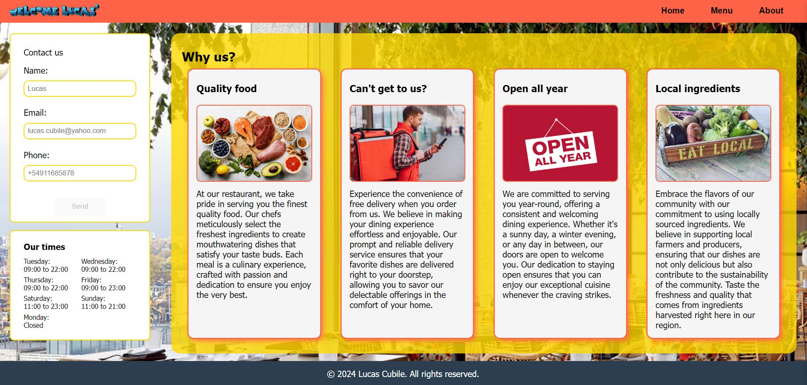

# Restaurant-page

A restaurant page to start implementing bundlers and ES6 modules.

# What the project is about

A simple single page website with tabs to clean the main content and render the appropiate page.

# What have I learned so far?

This restaurant page site was helpful to start learning more modern implementation of javascript as well some production building tools like webpack.

<ul>
  <li>Script writing in package.json to build a production project.</li>
  <li>Dependency installation.</li>
  <li>Webpack basic configuration.</li>
  <li>Code modularity in ES6 modules.</li>
  <li>Use of helper functions.</li>
</ul>

# Want to see it in action?

<a href="https://hroglardev.github.io/Restaurant-page/" target="_blank">Click here</a>

# How to use the app.

Right from the start the app is fully functional.

The page is mainly static display of information.

It displays a navigation menu to alternate between pages (default to home when user first enters) and a contact form.

Despite the form not submitting to anything, it is valdidated to make sure all inputs are filled.

# Want to track my progress?

Checkout my other projects in order to see my evolution:

<ol>
  <li><a href="https://github.com/hroglardev/odin-recipes" target="_blank">Recipes</a></li>
  <li><a href="https://github.com/hroglardev/Odin-landing-page" target="_blank">Landing Page</a></li>
  <li><a href="https://github.com/hroglardev/Rock-Paper-Scissors-TOP-Console" target="_blank">Console Rock, Paper, Scissors</a></li>
  <li><a href="https://github.com/hroglardev/Rock-Paper-Scissors-TOP" target="_blank">Rock, Paper, Scissors</a></li>
  <li><a href="https://github.com/hroglardev/Etch-a-Sketch" target="_blank">Etch a Sketch</a></li>
  <li><a href="https://github.com/hroglardev/Calculator" target="_blank">Calculator</a></li>
  <li><a href="https://github.com/hroglardev/Sign-up-form-TOP" target="_blank">Sign up form</a></li>
  <li><a href="https://github.com/hroglardev/Dashboard" target="_blank">Dashboard</a></li>
  <li><a href="https://github.com/hroglardev/Library" target="_blank">Library</a></li>
  <li><a href="https://github.com/hroglardev/Tic-tac-toe" target="_blank">Tic-tac-toe</a></li>
  <li><a href="https://github.com/hroglardev/Restaurant-page" target="_blank">You are here</a></li>
</ol>
